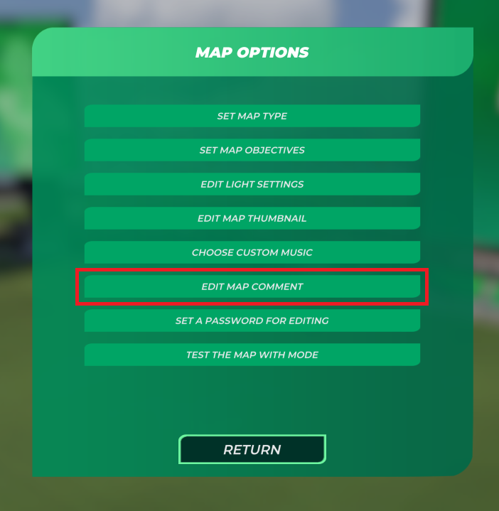
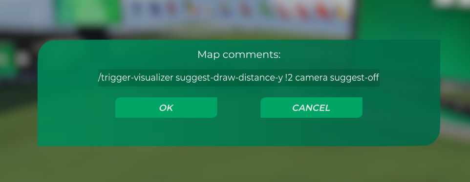

# Trigger Visualizer

Displays trigger volumes that appears in the current render context.

## Layout

Core code lives in `src/trigger/`.

- `data/sources/*` reads trigger data from the map.
- `render/` projects trigger volumes, outlines, fills, labels, and tile icons.
- `ui/` contains settings that the project uses.

## Trigger Sources

- Offzone volumes from map offzone data.
- MediaTracker trigger volumes from the different MT tracks embedded in the map data.
- Crystal trigger shapes from block/item trigger data.

Crystal support includes all triggers in all nadeo blocks/items as well as custom blocks/items (for those pesky hidden trigger volumes that some mappers hide xdd).

*Note, `GateExpandableSpecial*` and `GateExpandableGameplay*` blocks are drawn as approximate rectangles. `GateExpandableFinish*` uses a different method for getting the TriggerShape that is not exposed through the "Special" or "Gameplay" expandables, so it is still correct (the shape of the triggers are the same tho).

## Mapper Commands

Map comments can include Trigger Visualizer commands:

```text
/trigger-visualizer suggest-off
/trigger-visualizer force-off
/trigger-visualizer <trigger-type>,<> suggest-off
/trigger-visualizer <trigger-type>,<> force-off
/trigger-visualizer <trigger-type>[,<trigger-type>...] suggest-off
/trigger-visualizer <trigger-type>[,<trigger-type>...] force-off
/trigger-visualizer suggest-draw-distance-xz <units>
/trigger-visualizer suggest-draw-distance-xz !<blocks>
/trigger-visualizer suggest-draw-distance-y <units>
/trigger-visualizer suggest-draw-distance-y !<blocks>
/fx hide
/uci hide
```

`!<blocks>` converts block counts to world units automatically, as an example `/trigger-visualizer suggest-draw-distance-y !2` would set the draw-distance to 32*2 on the x/y axis, and 8\*2 on the y axis.

`suggest-off` asks Trigger Visualizer to start matching triggers hidden when the user respects map suggestions.
`force-off` always hides matching triggers.
Without a trigger type, these commands apply to all world rendering. With a trigger type, they only apply to matching sources, MediaTracker subtypes, Crystal subtypes, or gameplay trigger types.

`/fx hide` and `/uci hide` are established compatibility commands. Either command forces all Trigger Visualizer rendering off and cannot be overridden for that map, equivalent to `/trigger-visualizer force-off`.

An empty target list, `<>`, `*`, `all`, or `everything` is treated as the same as assigning no specification, so all types are affected.

Examples:

```text
/trigger-visualizer camera,offzone,crystal suggest-off
/trigger-visualizer cam3 force-off
/trigger-visualizer fog,cartrails suggest-off
/trigger-visualizer crystal suggest-off
/trigger-visualizer boost2 force-off
/trigger-visualizer crystalgate,checkpoint suggest-off
/trigger-visualizer * force-off
```
*Note, these are read from the maps 'map comment', to set a map comment go to:







Supported source targets:

- `MediaTracker`
- `Offzone`
- `Crystal`

Supported Crystal subtype targets:

- `CrystalBlock`
- `CrystalBlockWaypoint`
- `CrystalScreenInteraction`
- `CrystalGate`
- `CrystalTeleporter`
- `CrystalItem`
- `CrystalBlockItem`

Supported gameplay trigger targets:

- `Checkpoint`
- `Finish`
- `StartFinish`
- `Turbo`
- `Turbo2`
- `TurboRoulette`
- `TurboRouletteYellow`
- `TurboRouletteCyan`
- `TurboRoulettePurple`
- `Boost`
- `Boost2`
- `Cruise`
- `NoBrakes`
- `NoEngine`
- `NoSteering`
- `Slowmo`
- `Fragile`
- `Reset`
- `ForceAcceleration`
- `NoGrip`
- `VehicleTransformReset`
- `VehicleTransformCarSnow`
- `VehicleTransformCarRally`
- `VehicleTransformCarDesert`

Supported MediaTracker subtype targets:

- `Camera`
- `CustomCamera`
- `OrbitalCamera`
- `PathCamera`
- `PlayerCamera`
- `PlayerCameraSubtypeCamDefault`
- `PlayerCameraSubtypeCam1`
- `PlayerCameraSubtypeCam2`
- `PlayerCameraSubtypeCam3`
- `PlayerCameraSubtypeCamHelico`
- `PlayerCameraSubtypeCamFree`
- `PlayerCameraSubtypeCamSpectator`
- `2dTriangles`
- `3dTriangles`
- `CarTrails`
- `ColorsFX`
- `ColorGrading`
- `DepthOfField`
- `DirtyLens`
- `EditingCut`
- `FadingTransition`
- `Fog`
- `Ghost`
- `HDRBloom`
- `Image`
- `InertialTrackingCamFX`
- `ManiaLinkUI`
- `ManiaLinkURL`
- `MusicVolume`
- `OpponentVisibility`
- `ShakeCamFX`
- `Stereo3D`
- `SoundFX`
- `Spectators`
- `Text`
- `Time`
- `TimeSpeed`
- `ToneMapping`
- `VehicleLights`
- `MediaTrackerReset`
- `Unknown`

Target names are case-insensitive. Use no spaces inside the comma-separated target list; hyphens and underscores are accepted. Use `Reset` for Crystal/gameplay reset triggers, and `MediaTrackerReset`, `MTReset`, or `Empty` for empty MediaTracker clips that reset camera switches.

## Build

```powershell
python _build.py
```

## Credits

ar
